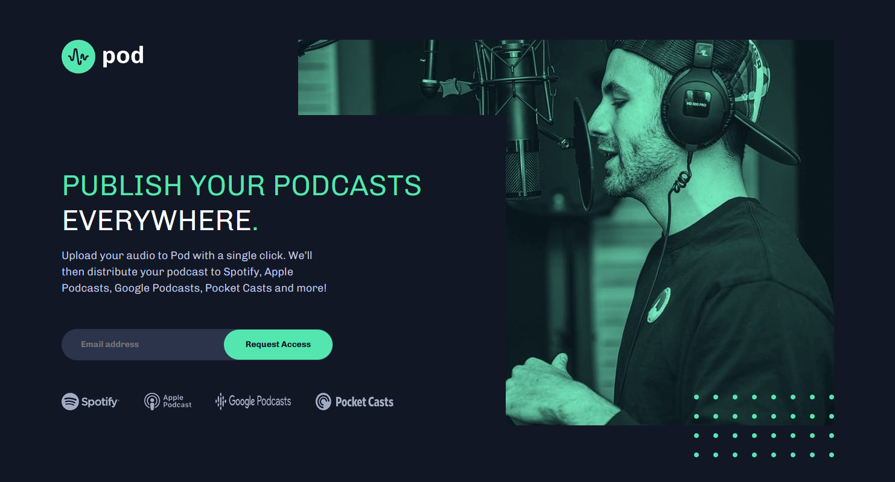

🎙️ Pod Request Access Landing Page

A responsive Pod Request Access Landing Page built as part of a Frontend Mentor challenge.
The project focuses on building a clean UI with an email signup form and validation.

🚀 Features

- Clean landing page layout
- Email input form
- Custom form validation
- Error messages for invalid or empty input
- Responsive layout (mobile → desktop)
- Podcast platform logos (Spotify, Apple, etc.)

| Technology             | Purpose                 |
| ---------------------- | ----------------------- |
| **HTML5**              | Semantic page structure |
| **CSS3**               | Styling and layout      |
| **JavaScript**         | Form validation         |
| **Flexbox / CSS Grid** | Layout alignment        |
| **GitHub Pages**       | Deployment              |

📸 Preview

